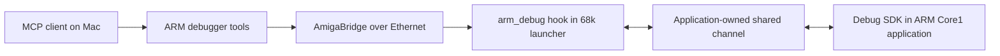

# Cooperative ARM debugging through MCP

This first implementation debugs **applications we build with the SDK**. It
adds nine tools to the workspace's Amiga DevBench MCP server and uses the
existing bridge's `CALLHOOK` IPC. No replacement bridge daemon or firmware
flash is required for this interface.

Pause takes effect at an instrumented checkpoint; step advances to the next
checkpoint. It cannot halt arbitrary instructions, attach to unmodified
ZZDarkForces/ZZQuake, or provide GDB/DWARF source stepping.



The 68k launcher keeps calling `ab_poll()` while ARM is paused. The ARM keeps
servicing its debug mailbox while paused. The SDK does not assume that
Amiga-visible addresses are ARM physical addresses.

## Tools

| MCP tool | Behavior |
| --- | --- |
| `amiga_arm_attach` | Validate protocol/session; optionally load a build-matched checkpoint map |
| `amiga_arm_status` | Read state, checkpoint, watched uint32 values, breakpoints and fault context |
| `amiga_arm_pause` | Request pause at the next checkpoint and wait |
| `amiga_arm_continue` | Resume or cancel a pending pause |
| `amiga_arm_step_checkpoint` | Advance one checkpoint from a paused state |
| `amiga_arm_breakpoint` | Set/clear up to eight checkpoint-ID breakpoints |
| `amiga_arm_read_memory` | Read 1-64 bytes of registered application RAM while paused/faulted |
| `amiga_arm_logs` | Read an eight-record log ring with cursor and overwrite count |
| `amiga_arm_detach` | Clear breakpoints and resume; faulted/finished targets stay stopped |

Tools report `debug_mode=cooperative_checkpoints` and
`instruction_stepping=false`. The software demo reports `execution=host_demo`.
`arm_instrumented` is an application's declared mode, not independent proof
that it ran on physical ARM hardware.

Fault context is supplied by the application's handler: fault code, PC, SP,
LR and CPSR. The SDK does not install exception vectors or capture a full live
register file. Logs hold at most 88 bytes each; up to eight application-defined
unsigned 32-bit values can be published at a checkpoint.

## Software demonstration

```sh
make test-amiga-arm
make amiga-arm-demo
```

Run `make setup-amiga` first if the existing environment is missing. The demo
listens only on `http://127.0.0.1:55018/mcp`, without connecting to hardware.
Its client name is `arm-debug-demo`. Another port can be selected with
`scripts/arm_debug_demo.py --port <port>` using the workspace Python.

Example MCP calls:

```text
amiga_arm_attach(client="arm-debug-demo")
amiga_arm_pause(client="arm-debug-demo")
amiga_arm_status(client="arm-debug-demo")
amiga_arm_step_checkpoint(client="arm-debug-demo")
amiga_arm_read_memory(client="arm-debug-demo", region=0, offset=0, size=16)
amiga_arm_logs(client="arm-debug-demo")
amiga_arm_detach(client="arm-debug-demo")
```

The demo executes the actual C runtime/relay natively on the Mac. This tests
the software path, including MCP HTTP, but not ARM instructions, AmigaOS IPC
or ZZ9000 cache/bus behavior. Stop the demo server with Ctrl-C afterward.

## Build real application components

```sh
make amiga-arm-build
```

The build uses local Clang's `arm-none-eabi` target, or
`ARM_CC=arm-none-eabi-gcc`, and the pinned Amiga cross-compiler container. If
the captured container connection is unavailable, select one explicitly:

```sh
python3 scripts/build_arm_debug.py \
  --container-command '["podman","--connection","nuflix-converter-root"]'
```

Outputs under `.context/amiga/arm-debug/`:

- `arm_debug_core.o`: Cortex-A9 ARM-state little-endian ELF with debug info.
- `arm_worker.o`: instrumented ARM example.
- `libarm_debug_relay.a`: 68k relay and AmigaBridge hook adapter.
- `arm-worker-points.json`: explicit checkpoint file/line mapping tied to a
  source/compiler-derived 32-bit build ID.
- `build.json`: source identity, compiler and artifact SHA256 hashes.
- `amiga-relay-probe`: standalone **68k software probe** for live bridge IPC
  validation; it does not launch or access the ARM.

The ARM objects are **integration components, not a standalone payload or
loader**. Link them with the application's existing XACP entry point, MMU,
stack, runtime and cooperative firmware-return code. A matching checkpoint
build ID prevents ordinary map mismatches; it is not authentication or binary
attestation. Other applications supply their own build ID and checkpoint map.

## Integration contract

1. Reserve a **64-byte-aligned, 1,088-byte shared channel** inside memory owned
   by the application and visible to both processors. The SDK assigns no
   global DDR address. Preserve existing firmware, Core0, framebuffer and
   Amiga Fast RAM allocations. Each side receives its own correct address.
   The XACP 1.7 high 248 MiB arena is ARM-only and cannot itself serve as this
   channel. See the [XACP memory notes](https://github.com/Xanxi-Amiga/XACP-ZZ9000/blob/main/docs/XACP_V1_7_DEVELOPER_NOTES.md).
2. Implement `ad_io.pull`, `push`, `barrier` and `idle` for the actual mapping,
   including any outer-cache policy. Prefer a deliberately noncached shared
   mapping. Barrier-only callbacks are valid only when the mapping permits
   them; never use the demo's no-op callbacks on hardware. Do not perform
   global PL310/L2 maintenance while Core0 services are active.
3. Before exposing the hook, ARM calls `ad_init` with a **fresh nonzero session
   nonce** agreed with the launcher and the application's build ID. Register
   valid readable RAM with `ad_add_region` before execution. Registered memory
   must remain valid for the channel's lifetime. Reusing session nonces
   defeats restart detection.
4. The 68k launcher calls `ab_init`, then `ad_bridge_bind` with its channel
   address and cache/order callbacks. Keep calling `ab_poll()`. One channel
   is supported per launcher. Its lifecycle and hook callbacks must be
   serialized; never reinitialize/free the page during an operation.
5. Add `ad_checkpoint(&debug, id, values, count)` at useful ARM boundaries.
   It waits while paused. Alternatively, `ad_enter` is nonblocking: a scheduler
   must service the debugger and idle without advancing work while paused.
6. Call `ad_log` from the same context. An application-owned exception handler
   may publish captured context through `ad_fault` only with a valid stack
   and channel mapping. SDK publication is **single-writer and non-reentrant**;
   nested exceptions need an application-specific emergency path. Arbitrary
   crashes cannot be assumed to execute C or dereference registered RAM safely.
7. On normal completion call `ad_finish`, collect results and use the existing
   cooperative Core1 return path. Unbind before freeing the channel, only
   after ARM stops using it. When quitting a paused app, first request
   detach/resume and let it reach shutdown. `ad_bridge_unbind` alone does not
   resume ARM or restore firmware state.

`amiga/arm_debug/examples/arm_worker.c` demonstrates checkpoint placement and
watched values without imposing a memory map or loader. Pass its generated
manifest to `amiga_arm_attach` to show source locations. This maps explicit
checkpoints, not arbitrary DWARF locals or every source line.

## Protocol and failure behavior

Shared words are big-endian with aligned 32-bit commit words. ARM converts
little-endian values explicitly. Writers own separate 64-byte cache lines:

| Bytes | Writer | Contents |
| --- | --- | --- |
| 0-255 | ARM | State, acknowledgement, values, breakpoints, fault and memory result |
| 256-319 | 68k | Session/sequence-tagged command mailbox |
| 320-1087 | ARM | Eight 96-byte log records |

ARM publishes status/logs with an odd/even sequence. The 68k relay copies a
consistent whole snapshot and serves it in chunks under a token, avoiding
mixed frames during Ethernet round trips. Another snapshot invalidates the
previous token; the host retries read-only snapshots up to three times.

The relay publishes command sequence last, accepts only the next sequence
for the current session and rejects an occupied mailbox. ARM validates both
again. The controller serializes transactions and matches bridge response
IDs. Command writes are never silently retried on timeout. A pause may remain
pending until a checkpoint; inspect status or cancel with continue. A restart
invalidates the attachment.

Use one controlling debugger per application. There is no ownership lease
between separate MCP servers. If a debugger disappears while paused, the app
stays paused until another connection attaches and continues/detaches, or its
launcher handles shutdown. The extension provides no arbitrary writes,
instruction patches, register edits, Core0 stops, firmware updates or OS task
suspension. It inherits the bridge's trusted-LAN assumptions. A dead 68k
launcher may trigger the upstream CALLHOOK timeout; this is not an out-of-band
recovery probe.

## Validation and next stage

Local verification: 18 tests exercising the actual native C runtime and
relay, including an MCP HTTP session, response correlation, pause/step,
breakpoints, memory bounds, malformed packets, stale sessions/snapshots,
pending-mailbox protection, timeout cancellation, log overwrites and faults.
The normal MCP smoke test discovers all 138 tools. Cortex-A9 objects and the
68k relay compile with warnings as errors.

**Live AmigaOS relay acceptance passed on the A4000TX on 2026-10-08.**
The 80,152-byte `amiga-relay-probe` was transferred to
`RAM:SixiesDev/amiga-relay-probe`, verified with CRC32 `E32FF7F3`, and run
with a 32 KiB stack. All nine MCP tools worked over Ethernet: attach, stable
pause, one-checkpoint step, breakpoint hit/clear, a verified 64-byte memory
read, status, logs, continue and detach. The checkpoint count advanced exactly
292 -> 293 on step; breakpoint 2 then stopped at hit 294. The probe was stopped
with Ctrl-C and its client unregistered cleanly; Workbench and the bridge
remained responsive. This ran the SDK core and relay in a single **68060
process**, reporting `host_demo`. It does **not** establish ARM execution,
cross-processor cache visibility or Core1 return.

Evidence: [live tool results](../amiga/records/2026-10-08/arm-debug/live-relay-validation.json).
The repeatable acceptance script is `tests/amiga/arm_debug/live_relay.py`.
Build and transfer the probe, then start it on the Amiga with a fresh nonzero
hexadecimal session nonce generated on the Mac:

```text
Protect RAM:SixiesDev/amiga-relay-probe +e
Stack 32768
Run >RAM:SixiesDev/relay-probe.log <NIL: RAM:SixiesDev/amiga-relay-probe <nonce>
```

Run the test from this workspace, supplying the same nonce:

```sh
.tools/amiga-venv/bin/python tests/amiga/arm_debug/live_relay.py --session <nonce>
```

The probe exits on Ctrl-C or after approximately five minutes of polling, even
while paused (bridge IPC can extend that duration). The test
checks its session and build identity before issuing commands and detaches
afterward. Stop the process separately after inspecting `Status FULL`; do not
reuse a previous CLI number.

**Physical ARM acceptance remains pending:** integrate a standalone
instrumented Core1 launcher, verify channel mapping/cache visibility and prove
clean Core1 return/relaunch. Inspection of the public v1.6/v1.7 maps found
named service/application regions and an ARM-only high arena, but no generic
shared-channel allocator. A proven application-owned allocation or an upstream
agreed memory-map extension is needed; an apparently unused fixed DDR address
is not an allocation. No board registers, shared DDR or firmware were changed
by the relay probe.

Full instruction/source debugging is a later stage: investigate Cortex-A9
monitor/exception or external debug support, full register capture, ARM/Thumb
breakpoints, instruction stepping, DWARF interpretation and a GDB adapter.
Those capabilities are not supplied by this checkpoint SDK or the existing
68k debugger APIs.
