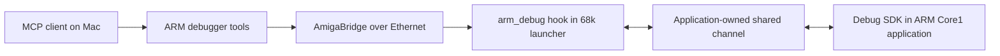

# Cooperative ARM debugging through MCP

This implementation debugs **applications we build with the SDK**. It
adds nine tools to the workspace's Amiga DevBench MCP server and uses the
existing bridge's `CALLHOOK` IPC. No replacement bridge daemon or firmware
flash is required for this interface.

The dedicated private development/backup repository is
[Amiga-MCP-Debugger](https://github.com/SkiltonUSA/Amiga-MCP-Debugger).
The XX19c launcher has now passed live debugging on the A4000TX's physical
ZZ9000 Core1; the original native and 68k probes remain separate test fixtures.

Pause takes effect at an instrumented checkpoint; step advances to the next
checkpoint. It cannot halt arbitrary instructions, attach to unmodified
ZZDarkForces/ZZQuake, or provide GDB/DWARF source stepping.



The 68k launcher keeps calling `ab_poll()` while ARM is paused. The ARM keeps
servicing its debug mailbox while paused. The SDK does not assume that
Amiga-visible addresses are ARM physical addresses.

## Tools

| MCP tool | Behavior |
| --- | --- |
| `amiga_arm_attach` | Validate protocol/session; optionally load a build-matched checkpoint map |
| `amiga_arm_status` | Read state, checkpoint, watched uint32 values, breakpoints and fault context |
| `amiga_arm_pause` | Request pause at the next checkpoint and wait |
| `amiga_arm_continue` | Resume or cancel a pending pause |
| `amiga_arm_step_checkpoint` | Advance one checkpoint from a paused state |
| `amiga_arm_breakpoint` | Set/clear up to eight checkpoint-ID breakpoints |
| `amiga_arm_read_memory` | Read 1-64 bytes of registered application RAM while paused/faulted |
| `amiga_arm_logs` | Read an eight-record log ring with cursor and overwrite count |
| `amiga_arm_detach` | Clear breakpoints and resume; faulted/finished targets stay stopped |

Tools report `debug_mode=cooperative_checkpoints` and
`instruction_stepping=false`. The software demo reports `execution=host_demo`.
`arm_instrumented` is an application's declared mode, not independent proof
that it ran on physical ARM hardware.

Fault context is supplied by the application's handler: fault code, PC, SP,
LR and CPSR. The SDK does not install exception vectors or capture a full live
register file. Logs hold at most 88 bytes each; up to eight application-defined
unsigned 32-bit values can be published at a checkpoint.

## Software demonstration

```sh
make test-amiga-arm
make amiga-arm-demo
```

Run `make setup-amiga` first if the existing environment is missing. The demo
listens only on `http://127.0.0.1:55018/mcp`, without connecting to hardware.
Its client name is `arm-debug-demo`. Another port can be selected with
`scripts/arm_debug_demo.py --port <port>` using the workspace Python.

Example MCP calls:

```text
amiga_arm_attach(client="arm-debug-demo")
amiga_arm_pause(client="arm-debug-demo")
amiga_arm_status(client="arm-debug-demo")
amiga_arm_step_checkpoint(client="arm-debug-demo")
amiga_arm_read_memory(client="arm-debug-demo", region=0, offset=0, size=16)
amiga_arm_logs(client="arm-debug-demo")
amiga_arm_detach(client="arm-debug-demo")
```

The demo executes the actual C runtime/relay natively on the Mac. This tests
the software path, including MCP HTTP, but not ARM instructions, AmigaOS IPC
or ZZ9000 cache/bus behavior. Stop the demo server with Ctrl-C afterward.

## Build real application components

```sh
make amiga-arm-build
```

The build uses local Clang's `arm-none-eabi` target, or
`ARM_CC=arm-none-eabi-gcc`, and the pinned Amiga cross-compiler container. If
the captured container connection is unavailable, select one explicitly:

```sh
python3 scripts/build_arm_debug.py \
  --container-command '["podman","--connection","nuflix-converter-root"]'
```

Outputs under `.context/amiga/arm-debug/`:

- `arm_debug_core.o`: Cortex-A9 ARM-state little-endian ELF with debug info.
- `arm_worker.o`: instrumented ARM example.
- `libarm_debug_relay.a`: 68k relay and AmigaBridge hook adapter.
- `arm-worker-points.json`: explicit checkpoint file/line mapping tied to a
  source/compiler-derived 32-bit build ID.
- `build.json`: source identity, compiler and artifact SHA256 hashes.
- `amiga-relay-probe`: standalone **68k software probe** for live bridge IPC
  validation; it does not launch or access the ARM.

These generic ARM objects are integration components. The separate, tested
XX19c launcher below supplies a standalone payload and loader. For other
applications, link the SDK with their existing XACP entry point, MMU,
stack, runtime and cooperative firmware-return code. A matching checkpoint
build ID prevents ordinary map mismatches; it is not authentication or binary
attestation. Other applications supply their own build ID and checkpoint map.

## Integration contract

1. Reserve a **64-byte-aligned, 1,088-byte shared channel** inside memory owned
   by the application and visible to both processors. The SDK assigns no
   global DDR address. Preserve existing firmware, Core0, framebuffer and
   Amiga Fast RAM allocations. Each side receives its own correct address.
   The XACP 1.7 high 248 MiB arena is ARM-only and cannot itself serve as this
   channel. See the [XACP memory notes](https://github.com/Xanxi-Amiga/XACP-ZZ9000/blob/main/docs/XACP_V1_7_DEVELOPER_NOTES.md).
2. Implement `ad_io.pull`, `push`, `barrier` and `idle` for the actual mapping,
   including any outer-cache policy. Prefer a deliberately noncached shared
   mapping. Barrier-only callbacks are valid only when the mapping permits
   them; never use the demo's no-op callbacks on hardware. Do not perform
   global PL310/L2 maintenance while Core0 services are active.
3. Before exposing the hook, ARM calls `ad_init` with a **fresh nonzero session
   nonce** agreed with the launcher and the application's build ID. Register
   valid readable RAM with `ad_add_region` before execution. Registered memory
   must remain valid for the channel's lifetime. Reusing session nonces
   defeats restart detection.
4. The 68k launcher calls `ab_init`, then `ad_bridge_bind` with its channel
   address and cache/order callbacks. Keep calling `ab_poll()`. One channel
   is supported per launcher. Its lifecycle and hook callbacks must be
   serialized; never reinitialize/free the page during an operation.
5. Add `ad_checkpoint(&debug, id, values, count)` at useful ARM boundaries.
   It waits while paused. Alternatively, `ad_enter` is nonblocking: a scheduler
   must service the debugger and idle without advancing work while paused.
6. Call `ad_log` from the same context. An application-owned exception handler
   may publish captured context through `ad_fault` only with a valid stack
   and channel mapping. SDK publication is **single-writer and non-reentrant**;
   nested exceptions need an application-specific emergency path. Arbitrary
   crashes cannot be assumed to execute C or dereference registered RAM safely.
7. On normal completion call `ad_finish`, collect results and use the existing
   cooperative Core1 return path. Unbind before freeing the channel, only
   after ARM stops using it. When quitting a paused app, first request
   detach/resume and let it reach shutdown. `ad_bridge_unbind` alone does not
   resume ARM or restore firmware state.

## Physical ZZ9000 launcher (XX19c)

Build using Clang with ARM support, LLVM `ld.lld` (on Mac, `brew install lld`),
and the pinned 68k compiler container:

```sh
python3 scripts/build_zz9000_debug.py \
  --container-command '["podman","--connection","nuflix-converter-root"]'
```

`make amiga-zz9000-build` uses the workspace's configured container command.
Outputs in `.context/amiga/arm-debug/zz9000/` include `zzarm-debug` (Amiga Hunk),
`zzarm.elf` (ARM with symbols), an embedded-image header and hash/build record.
The linker emits a relocatable image; the packer accepts only bounded local
`R_ARM_RELATIVE` relocations. The 68k executable embeds this payload and a
tiny mapping probe, so there is no separate runtime payload file to misplace.

Only run this launcher on the verified **XX19c / XACP 1.7** setup, after
checking no other Core1 application is active. Its named owner port prevents
duplicate instances of this launcher, not unrelated games. The `0x0113`
firmware register alone cannot distinguish all firmware variants.

Transfer `zzarm-debug` to `RAM:SixiesDev/`, give it execute protection and run
with stack 32768 and a fresh nonzero hexadecimal nonce (Mac:
`python3 -c 'import secrets; print(secrets.token_hex(4))'`). `MAP` performs the
short ARM mapping probe and exits. `RUN` also starts the debugger:

```text
Stack 32768
RAM:SixiesDev/zzarm-debug <nonce> MAP >RAM:SixiesDev/zzarm-map.log
RAM:SixiesDev/zzarm-debug <fresh-nonce> RUN >RAM:SixiesDev/zzarm-run.log
```

For asynchronous operation, put the Stack and RUN-command lines into an Amiga
script, then `Run >NIL: Execute RAM:SixiesDev/start-zzarm`. This preserves the
child's log redirection. The registered MCP client is **`zzarm-debug`**.
Run the live acceptance test with the matching nonce:

```sh
.tools/amiga-venv/bin/python tests/amiga/arm_debug/live_relay.py \
  --target zz9000 --session <nonce> \
  --output .context/amiga/arm-debug/zz9000/live-arm-validation.json
```

Ctrl-C stops the launcher, including when ARM is paused. From the bridge,
inspect `Status FULL` and send `Break <its-current-CLI> C`. The launcher also
has a roughly five-minute polling limit; IPC can extend elapsed duration.

### Memory ownership and cache contract

- The launcher finds the ZZ9000 graphics and Fast RAM ConfigDev entries and
  uses **Exec `AllocAbs` on a real free chunk**, under scheduler exclusion,
  to reserve 128 KiB in the ZZ9000 Fast RAM bank. It never writes an unallocated
  map gap. Code, control records, the debug channel and the ARM stack all live
  inside that allocation until Core1 has been quiesced.
- Legacy translation `ARM = Amiga address - graphics board base + 0x001f0000`
  is only a **candidate** until independently tested. A short P96-allocated,
  locked bitmap hosts a position-independent bootstrap. It reads eight
  session-derived words from the candidate allocation and reports them to
  the bitmap. A mismatch or unexpected CPU/cache state aborts the launch.
  The bitmap is unlocked/freed before the debugger starts. Polling under the
  lock is capped at 20 ticks; reset/flush overhead is additional.
- Actual allocation in the initial runs was Amiga `0x50000040` -> ARM
  `0x101f0040`. These are **observations, not reserved addresses**. The next
  allocation may differ. This uses AmigaOS-owned memory with an explicit
  reservation, not an ARM-private claim on live OS RAM.
- Entry verifies SCTLR MMU/D-cache/I-cache bits are all clear (`mask 0x1005`)
  before switching stacks. The worker also checks MPIDR identifies Core1.
  **This version deliberately keeps ARM caches and MMU disabled.** ARM
  callbacks use `DSB SY`; 68k callbacks use Exec `CacheClearE(..., CACRF_ClearD)`
  around shared-memory reads/writes. Writer records have separate cache lines.
  A continuously changing challenge/response also runs while checkpoint-paused.
- The launcher does not alter SCTLR, translation tables or PL310/L2 settings.
  The existing firmware's synchronous `ARM_RUN` operation performs its own
  published cache maintenance/reset sequence. A preflight idle reset precedes
  reuse of memory. No global cache-maintenance routine is called from Core1.
- Shutdown asks ARM to exit through its normal C/assembly epilogue, restoring
  the firmware stack and callee-saved registers. `RET1` records reaching the
  final epilogue; it is not an observation from inside the firmware loop.
  The host then synchronously resets Core1 to idle **before** freeing memory,
  including error paths. This is a bounded prototype teardown, not proof that
  a reset-free return works for arbitrary applications.

The memory/cache facts were checked against the shipped XX19c `core2.c` and
register handlers, the P96 API autodoc in the pinned cross-toolchain, and the
[legacy RTL mapping shown in the upstream mapping change](https://github.com/BlitterStudio/zz9000-firmware/pull/42).
The [P96 developer documentation](https://wiki.icomp.de/wiki/P96#Software_Developer_archive)
explains why bitmap locks must stay short. Runtime challenge tests, not the
legacy formula alone, establish the translation on this machine.

`amiga/arm_debug/examples/arm_worker.c` demonstrates checkpoint placement and
watched values without imposing a memory map or loader. Pass its generated
manifest to `amiga_arm_attach` to show source locations. This maps explicit
checkpoints, not arbitrary DWARF locals or every source line.

## Protocol and failure behavior

Shared words are big-endian with aligned 32-bit commit words. ARM converts
little-endian values explicitly. Writers own separate 64-byte cache lines:

| Bytes | Writer | Contents |
| --- | --- | --- |
| 0-255 | ARM | State, acknowledgement, values, breakpoints, fault and memory result |
| 256-319 | 68k | Session/sequence-tagged command mailbox |
| 320-1087 | ARM | Eight 96-byte log records |

ARM publishes status/logs with an odd/even sequence. The 68k relay copies a
consistent whole snapshot and serves it in chunks under a token, avoiding
mixed frames during Ethernet round trips. Another snapshot invalidates the
previous token; the host retries read-only snapshots up to three times.

The relay publishes command sequence last, accepts only the next sequence
for the current session and rejects an occupied mailbox. ARM validates both
again. The controller serializes transactions and matches bridge response
IDs. Command writes are never silently retried on timeout. A pause may remain
pending until a checkpoint; inspect status or cancel with continue. A restart
invalidates the attachment.

Use one controlling debugger per application. There is no ownership lease
between separate MCP servers. If a debugger disappears while paused, the app
stays paused until another connection attaches and continues/detaches, or its
launcher handles shutdown. The extension provides no arbitrary writes,
instruction patches, register edits, Core0 stops, firmware updates or OS task
suspension. It inherits the bridge's trusted-LAN assumptions. A dead 68k
launcher may trigger the upstream CALLHOOK timeout; this is not an out-of-band
recovery probe.

## Validation and next stage

Local verification: 22 tests exercising the actual native C runtime and
relay, including an MCP HTTP session, response correlation, pause/step,
breakpoints, memory bounds, malformed packets, stale sessions/snapshots,
pending-mailbox protection, timeout cancellation, log overwrites and faults.
The four loader tests cover allocation bounds, zero-filled BSS and rejection
of unsafe relocation types/targets. The MCP smoke test discovers all 138 tools. Cortex-A9 objects and the
68k relay compile with warnings as errors.

**Live AmigaOS relay acceptance passed on the A4000TX on 2026-10-08.**
The 80,152-byte `amiga-relay-probe` was transferred to
`RAM:SixiesDev/amiga-relay-probe`, verified with CRC32 `E32FF7F3`, and run
with a 32 KiB stack. All nine MCP tools worked over Ethernet: attach, stable
pause, one-checkpoint step, breakpoint hit/clear, a verified 64-byte memory
read, status, logs, continue and detach. The checkpoint count advanced exactly
292 -> 293 on step; breakpoint 2 then stopped at hit 294. The probe was stopped
with Ctrl-C and its client unregistered cleanly; Workbench and the bridge
remained responsive. This ran the SDK core and relay in a single **68060
process**, reporting `host_demo`. It does **not** establish ARM execution,
cross-processor cache visibility or Core1 return.

Evidence: [live tool results](../amiga/records/2026-10-08/arm-debug/live-relay-validation.json).
The repeatable acceptance script is `tests/amiga/arm_debug/live_relay.py`.
Build and transfer the probe, then start it on the Amiga with a fresh nonzero
hexadecimal session nonce generated on the Mac:

```text
Protect RAM:SixiesDev/amiga-relay-probe +e
Stack 32768
Run >RAM:SixiesDev/relay-probe.log <NIL: RAM:SixiesDev/amiga-relay-probe <nonce>
```

Run the test from this workspace, supplying the same nonce:

```sh
.tools/amiga-venv/bin/python tests/amiga/arm_debug/live_relay.py --session <nonce>
```

The probe exits on Ctrl-C or after approximately five minutes of polling, even
while paused (bridge IPC can extend that duration). The test
checks its session and build identity before issuing commands and detaches
afterward. Stop the process separately after inspecting `Status FULL`; do not
reuse a previous CLI number.

**Physical ARM acceptance passed on 2026-10-08.** The standalone launcher
verified CPU ID `0x413fc090`, MPIDR `0x80000001` and SCTLR `0x08c50878` from
actual Core1 instructions. All nine MCP tools passed against the ARM worker:
the first session paused at hit 11415, stepped to 11416 and stopped on its
breakpoint at 11417. The registered 64-byte memory sample matched `00..3f`.
The first completed run logged 67 successful cache-visibility echoes, `RET1`
and launcher exit 0 with the allocation released. Raw evidence and build
identities are in [the ZZ9000 records](../amiga/records/2026-10-08/arm-debug/zz9000/).
A second launch passed the same nine tools, then was explicitly paused and
stopped via Ctrl-C. It logged another 218 successful visibility echoes,
`RET1`, exit 0 and released memory. Postflight found zero bridge clients,
Workbench as the only screen and the bridge still responsive. This confirms
relaunch and paused shutdown on the tested machine, with 285 echoes total.

This verifies the uncached cooperative path on the tested XX19c machine.
Cache-enabled MMU mappings, arbitrary application integration, exception
vector capture, long-duration stress and instruction/source stepping remain
separate work. No firmware was flashed or persistent Amiga startup changed.

Full instruction/source debugging is a later stage: investigate Cortex-A9
monitor/exception or external debug support, full register capture, ARM/Thumb
breakpoints, instruction stepping, DWARF interpretation and a GDB adapter.
Those capabilities are not supplied by this checkpoint SDK or the existing
68k debugger APIs.
