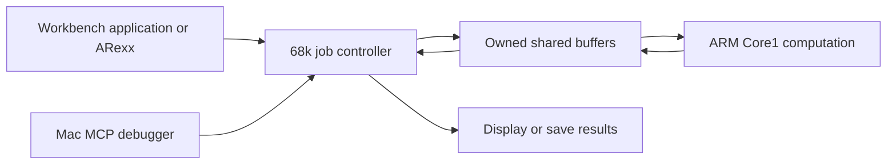

# Amiga ARM Acceleration Roadmap

Build a Workbench fractal explorer first, turn its working computation path
into a reusable service, then use that service for image tools and audio
processing. The objective is faster applications and a more responsive A4000TX
while demanding calculations run on the ZZ9000.

This is the proposed development sequence as of 8 October 2026. The debugger
foundation and first fractal demo are complete. Benefits and effort below are engineering
estimates, not measured speedups or delivery dates. The project lives in
[Amiga MCP Debugger](https://github.com/SkiltonUSA/Amiga-MCP-Debugger).

## SDL milestone completed (2026-10-08)

The interactive SDL ZZFractal preview now has zoom/pan, CPU/ARM selection,
iteration limits, cancellation, AppIcon support and temporary 16-/32-bit RTG
screens. Fourteen full-frame oracle comparisons and native colour samples
passed. A reusable cooperative client in `amiga/compute/xx19c.*` supplies
immutable tile requests, generation-safe cancellation, bounded waits and
separate timing measurements. It currently serves one application; milestone
3 still requires a second client and a broader workload contract.

Default ARM wall time was 7.575 s versus 17.427 s on the 68060, but compute
slices took about 2.894 s on ARM versus 2.233 s on the 68060. Unequal scheduling
explains why wall-time alone is misleading. Next: normalize work/yield budgets,
profile the kernel and validate optimization before considering cache changes.
See [SDL fractal development](amiga-sdl-fractal.md).

## What we can build on

Our physical Core1 debugger has passed two sessions, all nine MCP tools,
285 shared-memory echoes, relaunch and shutdown while paused. The project
has 22 automated tests. Its current worker uses an Exec-owned 128 KiB block
in ZZ9000 Fast RAM, with a runtime address-mapping check. ARM MMU and caches
remain disabled. This proves control and communication; it is not yet a
fast application runtime. [Acceptance record](../amiga/records/2026-10-08/arm-debug/zz9000/acceptance.json).

The 68060 continues to own AmigaOS, windows, input, file access and device
integration. Core1 receives explicit computation jobs. Core0 remains with
firmware and existing services. Existing XACP applications already demonstrate
ARM game engines, synthesis and media decoding; those establish feasibility,
not performance measurements for our proposed applications.
[XACP project overview](https://github.com/Xanxi-Amiga/XACP-ZZ9000).

## Development sequence

| Milestone | Deliverable | Expected benefit | Relative effort | Completion gate |
| --- | --- | --- | --- | --- |
| 0 Complete | Physical cooperative ARM debugger | Inspect and control our own ARM programs | Complete | Recorded hardware acceptance |
| 1 Complete | Workbench Mandelbrot explorer | First visible, interactive offload application | Complete | Physical pixel comparisons, cancellation and ten paused shutdowns passed |
| 2 | Faster ARM runtime and benchmark report | Make computation substantially more useful | High | Correct cache/memory behavior and measured total-time gain |
| 3 | Reusable compute job interface | Let several applications share the development investment | Medium to high | Fractal app and a second client use the same API |
| 4 | Image processing utility | Faster thumbnails, resizing, filters and batch conversions | Medium after 3 | Real image batches improve, including transfer and disk time |
| 5 | Offline audio processing, then live effects | Faster sample processing; potentially lower 68k audio workload | Medium offline, high live | Correct samples; live mode meets measured buffer deadlines |
| 6 | Selected 3D, simulation or game workloads | More ambitious visuals and application features | High, per project | Profiled workload justifies the port and meets its frame budget |

Milestones 1–3 form the main sequence. Image tools are the recommended first
practical application afterward. Audio and 3D are subsequent choices, not
parallel commitments. Dates should follow measurements from the first demo.

## Milestone 1 Fractal explorer

Start with a **320 by 240 Mandelbrot image in a normal Workbench window**.
Provide Render, Cancel, zoom selection, reset view, progress and elapsed time.
Add a 68060/ARM renderer selector for comparison. Julia sets, palette cycling,
larger images, image export and scripted zoom animations follow the first
working release.

Implement the arithmetic once in portable C with a specified fixed-point
format, rounding and overflow behavior. Use the same bounds and iteration
limit on both processors. This gives us exact comparison vectors before
introducing floating-point differences. Limit initial zoom depth to what the
chosen numeric format can represent.

Render in small tiles. A starting candidate is 32 by 16 pixels with 16-bit
iteration counts: 1 KiB per tile, or 2 KiB for two buffers. The full display
bitmap stays under 68k/P96 ownership. Define and validate the tile-buffer
layout alongside code, control data and stack; do not put a full large image
into the existing debugger allocation or assume an unused offset is free.

Use job IDs and view-generation numbers so cancelled renders cannot paint
old tiles into a newly zoomed view. Bound work between cancellation checks,
including inside long iteration loops. Only the 68k updates the window;
keep P96 locks short. The initial milestone uses the verified cache-off
runtime and prioritizes correctness over speed.

Place debugger checkpoints at tile dispatch, computation boundaries and
completed-tile publication. Publish tile coordinates, iteration limits and
progress as watched values. Checkpoint pause must leave the Workbench event
loop and launcher shutdown path running.

Acceptance targets, to be measured on the actual machine:

- Exact tile agreement between the reference, 68060 and ARM implementations
  for ordinary views and boundary cases.
- Visible progressive rendering; window movement and controls remain usable.
- Cancel acknowledged within 250 ms for the initial supported settings;
  tune work sizes if this target is missed.
- Twenty render/cancel/zoom cycles and ten launch/quit cycles without stale
  tiles, lost resources or a restart requirement.
- MCP pause, inspection and resume work during rendering; quitting while
  paused releases the application and its memory.
- Record baseline end-to-end times even if the uncached ARM version is slower.

Existing XACP fractal demonstrations provide useful historical reference,
but their documentation notes interface changes. Our instrumented renderer
will be our own source, using the tested XX19c launcher.
[Fractal references](https://github.com/Xanxi-Amiga/XACP-ZZ9000/tree/main/applications/fractals).

## Milestone 2 Faster computation with measured gains

Separate shared communication from private computation. Design a dedicated
Core1 MMU/cache configuration, an owned private workspace, and a complete
entry/return state contract before enabling caches. Keep shared control
records and exchange buffers deliberately noncached, or implement explicit
range coherency with proof for both processors. Preserve Core0 services.

The published XACP 1.7 high Core1 arena provides 248 MiB, but it is not directly
accessible from the Amiga; using it requires ARM mapping and explicit staging.
It is a candidate for larger private working data, not part of the currently
verified allocator. Never overlap its guard/reserved areas or treat the entire
board's DDR as application memory. Core1 must not perform generic cache
maintenance that reaches shared PL310 while Core0 services are active.
[XX19c memory and cache rules](https://github.com/Xanxi-Amiga/XACP-ZZ9000/blob/main/docs/XACP_V1_7_DEVELOPER_NOTES.md).

First optimize the scalar renderer. Then evaluate FPU/NEON paths with explicit
register/context preservation and numerical tests. Vectorization is a measured
optimization, not a prerequisite for the first image.

Measure 68060, ARM uncached and ARM optimized on identical workloads. Record
computation, submission, transfers, display conversion and total elapsed time,
plus buffer sizes, compiler options, instrumentation and correctness checks.
Report cold startup separately from repeated jobs. Use at least five timed
runs after warmup and report median and spread. Compare equally instrumented
paths or clearly identify profiling overhead.

The decision metric is **time from user action to usable result**. A fast ARM
kernel may still lose on a small job once transfers are included. Keep a 68k
path for small jobs and determine the crossover experimentally. Also measure
responsiveness and 68k availability: these can improve even when total task
time changes little. No speed multiplier is promised before this stage.

## Milestone 3 An interface other applications can use

Extract a small C job API from the fractal application before committing to a
resident Amiga shared library. Include capability discovery, submit, poll/wait,
cancel, results, bounds, error reporting and session/version checks. Support
an explicit CPU fallback when an operation has one. Keep the MCP debugger
optional: normal applications should run without a connected Mac.

Build Shell and ARexx clients for scripted rendering and batch jobs. Keep all
AmigaOS calls on the 68k. Typed, bounded requests are preferable to exposing
arbitrary addresses through an application interface.

A later broker may queue jobs for multiple clients, but **Core1 executes one
owned workload at a time**. Coordinate our clients and refuse incompatible
concurrent work. Unmodified games do not participate in our ownership scheme;
release Core1 before launching them. This does not turn AmigaOS into an SMP OS.

Gate this milestone on two independent clients using the same API, version
mismatch rejection, cancellation, disconnect handling, and operation without
MCP. Keep the tested reset-to-idle teardown until a replacement is proven.

## Which workloads offer the most value

These are engineering priorities based on computational structure; their
benefits remain to be benchmarked.

| Workload | What ARM would do | What stays on 68k | Outlook |
| --- | --- | --- | --- |
| Image tools | Resample, rotate, convolve, quantize and later decode selected formats | Files, requesters, previews and save/export | Best first practical project; keep several operations on ARM between transfers |
| Batch sample tools | Resample, normalize, filter and calculate spectra | File access, editing controls and playback integration | Strong next choice; start offline before adding real-time deadlines |
| Rendering | Fractals, ray tracing, geometry transforms, lighting and software rasterization | Input, window management and display submission | Good demonstrations and potentially useful tools; resolution/transfer budgets matter |
| Compression and checksums | Compress/decompress blocks, hash batches | Filesystem and archive orchestration | Feasible, but disk or bus speed may dominate; benchmark before broad integration |
| Search and document tools | Index parsing, full-text search or selected PDF/image rasterization | GUI, files and result display | Possible later; parsers, fonts and library porting add substantial effort |
| Simulations and game engines | Large searches, physics, procedural generation and complete suitable engines | Amiga frontend and device integration | Case-by-case; prefer substantial jobs over many tiny cross-CPU calls |

For existing software, start with an open-source application, a documented
plugin interface or a standard service interface. Acceleration requires a
route for that program to submit work. Arbitrary existing 68k binaries will
not become faster just because our ARM service is running.

Audio should build on existing infrastructure where appropriate. ZZMIDI
already documents ARM SoundFont synthesis exposed through CAMD and AHI;
investigate interoperability rather than duplicating its whole service.
Our proposed DSP worker would be separate, and coexistence needs its own test.
[ZZMIDI interfaces](https://github.com/Xanxi-Amiga/XACP-ZZ9000/tree/main/applications/ZZMIDI).

For Sixies, keep the small 5 by 5 rules engine on the 68060 unless profiling
shows a reason to move it. More promising optional ARM tasks are bulk AI
search, asset processing, large visual effects or audio processing. Preserve
the portable rules/conformance contract if a port is started.

## Limits and longer term work

The ARM cannot increase Chip RAM, AGA bandwidth, physical disk throughput or
the Zorro bus limit. It can move calculations off the 68060 and sometimes
reduce transfers by returning compact results. Modern browser engines, modern
GPU-style acceleration, large language models and transparent whole-system
68k acceleration are outside the initial roadmap.

Keep the debugger progressing alongside useful applications: richer watched
data and fault reporting first, then investigate exception-based breakpoints,
full registers, DWARF and instruction stepping as a separate advanced effort.
Those features are not required to ship the fractal explorer or image tools.

The [first fractal demo](amiga-fractal-demo.md) has passed physical acceptance.
The next implementation milestone is the cache/memory performance work in
stage 2, with a separate benchmark of computation, exchange and display costs.
Image tools follow the reusable interface; they do not bypass this runtime work.
