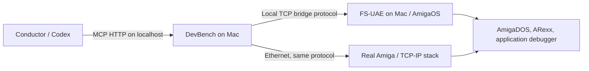

# Amiga application development

This workspace integrates [Amiga DevBench](https://github.com/geekychris/amiga_mcp)
for AmigaOS applications, OS inspection, ARexx and debugging. It does not port
Sixies gameplay. The physical target is an **Amiga 4000TX with a TF4060
(68060), AGA and AmigaOS 3.2.3 Workbench**. The user-provided inventory is
recorded in `amiga/target.json` and was audited on 2026-10-07. Read
[session memory](amiga-session-memory.md) for the current configuration and
[backup/recovery notes](amiga-backup-and-restore.md) for preserved evidence.

| Component | Target hardware |
| --- | --- |
| Memory | 2 MiB Chip, 624 MiB Fast; audited bank layout in `amiga/target.json` |
| Graphics | ZZ9000, ARM Cortex-A9 at 666 MHz as reported |
| Ethernet | X-Surf 100 with Roadshow; address in local connection settings |
| Storage | Buddha IDE controller |
| Additional expansion | Freeway Triton Lite |

The MCP server runs on the development Mac; the bridge and AmigaOS application
run on the 68060. The ZZ9000's ARM is a separate development target, not the
CPU target for ordinary AmigaOS applications. Keep OS-facing graphics code
usable on AGA and RTG screens; test card-specific features on the physical
ZZ9000. The initial bridge/probe retain the upstream `-m68020` build baseline;
runtime compatibility must be checked with the target's installed 68060
support libraries before hardware deployment.

The upstream commit and compiler image digest are recorded in
`amiga/upstream.json`; Python dependencies are pinned in
`amiga/requirements.lock`. Downloads and build products stay in `.tools/` and
`.context/`. No ROM or Workbench installation is bundled.



## Host setup

Requirements: Git, `uv`, and a running Docker-compatible container runtime
capable of running Linux amd64 images. The setup installs Python 3.12 locally;
it does not change your system Python. FS-UAE runs locally on the Mac.

```sh
make setup-amiga
make amiga-doctor
make amiga-build
make test-amiga
make amiga-sim
```

`amiga-build` cross-compiles the bridge, `libbridge.a`, and `sixies_probe`, checks
that the executables are Amiga Hunk files, then stages them with `probe.rexx`
under `.context/amiga/shared/Dev/`. Debug symbols remain in the probe binary.
`amiga-sim` runs the upstream protocol simulator and dashboard. It does **not**
boot AmigaOS or execute the compiled program. Stop it with Ctrl-C before
starting another profile in this workspace.

Local configuration is `.context/amiga/settings.json`. The HTTP port defaults
to the workspace's `CONDUCTOR_PORT` (55010 outside Conductor). The simulator
uses HTTP+1, GDB uses HTTP+2, and local FS-UAE bridge defaults to HTTP+3. Use a
different base in settings when running workspaces outside Conductor.

The container command is an argument array, for example `["docker"]` or
`["podman", "--connection", "podman-machine-default-root"]`. On this Mac,
Podman was available and its named root connection was used; the global
default points at a different, unavailable machine. Start the intended VM
from Podman Desktop or with `podman machine start podman-machine-default`.
`amiga-doctor` reports actual runtime connectivity. Bootstrap deliberately
preserves existing local settings on reruns.

## MCP in Conductor

Setup creates a gitignored `.codex/config.toml` if none exists, using the local
HTTP URL. If there is already a config, it is preserved and the fragment is
written to `.context/amiga/codex-mcp.toml` for merging. `codex mcp get amiga`
verifies registration. Start the server and open a new agent session to load
the integration; an existing session's tool list is not changed by editing
the file. Project configuration requires a trusted workspace.

Conductor uses the [agent's own MCP configuration](https://www.conductor.build/docs/reference/mcp).
The Codex format is documented in [OpenAI's MCP guide](https://developers.openai.com/codex/mcp).
The dashboard is `http://127.0.0.1:<http_port>/`, MCP is `/mcp`, and the GDB
remote endpoint is `127.0.0.1:<http_port+2>`.

## Mac FS-UAE prototype

FS-UAE, the editor, compiler and MCP server all run on this Mac. The installed
application is `/Applications/FS-UAE.app`; its executable reports version
3.1.66 and is an Intel macOS binary. Launch/version detection has been checked;
booting AmigaOS still requires the user's ROM and bootable OS volume.

1. Run `make setup-amiga` to generate `.context/amiga/sixies.fs-uae` from
   `amiga/emulator/sixies.fs-uae.example`. Existing local emulator configuration
   is preserved. Set `kickstart_file` to an existing absolute path to your
   A4000-compatible ROM and `hard_drive_0` to a bootable Workbench 3.2.3 HDF
   or directory with appropriate 68060 support. Use a development copy of
   the OS volume; the emulator can write to it.
2. Run `make amiga-build`, then `make amiga-emulator`. The template selects
   A4000/68060, AGA, 2 MB Chip, 256 MB Zorro III Fast RAM, and disables JIT.
   This is a prototype allocation, not a reproduction of the hardware's
   reported 284 MB Fast RAM or its unknown bank layout. The local shared
   directory is mounted as `DH2`, volume `SixiesDev`; binaries appear in
   `DH2:Dev/`. The launcher refuses to start if the ROM or boot-volume path
   is missing.
3. The template enables `bsdsocket.library` emulation. In the Amiga Shell,
   start `SYS:System/RexxMast` if not already running, then:

   ```text
   Stack 32768
   Run DH2:Dev/amiga-bridge TCP <fsuae-port>
   Run DH2:Dev/sixies_probe
   ```

   Replace `<fsuae-port>` with `profiles.fsuae.port` from local settings.
   Setup writes the actual command in a comment in the local emulator config.
4. Stop any simulator server in this workspace and run `make amiga-fsuae`
   in a second terminal. It connects to the emulator's guest bridge at
   `127.0.0.1:<fsuae-port>`. The OS runs inside FS-UAE; this is separate from
   `make amiga-sim`, which only simulates the bridge protocol.

Start on an AGA screen, then add an emulated RTG configuration for OS-level
display checks. Physical expansion cards need separate hardware acceptance.
The template uses FS-UAE's [A4000 model](https://fs-uae.net/docs/options/amiga_model/),
a [68060 CPU override](https://fs-uae.net/docs/options/cpu/), and
[bsdsocket emulation](https://fs-uae.net/docs/options/bsdsocket_library/).

The guest bridge is the TCP **server**; DevBench connects to it. This uses
guest `bsdsocket.library` transport, distinct from emulated serial-over-TCP.
On hardware, Roadshow provides that API through X-Surf 100. See the
[upstream TCP transport guide](https://github.com/geekychris/amiga_mcp/blob/a346995a30948fff03faa3b3efbaf5a3bdb131dc/docs/tcp-transport.md).
The bridge offers privileged OS operations over unauthenticated TCP; keep
the connection on a trusted development network. The optional patched
FS-UAE HTTP debugger is disabled because the installed emulator is stock.

## Application iteration and acceptance

Edit `amiga/examples/sixies_probe/main.c`, then `make amiga-build`. Sources are
staged in the tool checkout's `examples/sixies_probe` directory for upstream
project discovery. Do not edit the staged copy. MCP builds of the probe also
restage source and build its bridge dependency.

The probe keeps AmigaOS running, polls the bridge, emits logs and exposes
`ticks` and `running`. Setting `running` to zero or sending Ctrl-C exits
cleanly. Use the following checks on the **booted emulator**:

| Check | MCP action / expected result |
| --- | --- |
| Connectivity | `amiga_ping`, then `amiga_capabilities` |
| OS access | `amiga_list_tasks`, `amiga_sysinfo` |
| DOS | `amiga_run_script` with `Version` |
| App instrumentation | Inspect `sixies_probe` variables; `ticks` increases |
| ARexx | `amiga_arexx_ports`; send `DH2:Dev/probe.rexx` to `REXX` with `amiga_arexx_send`; expect `SIXIES_AREXX_OK` |
| Build/deploy | `amiga_build_deploy_run(project="examples/sixies_probe", command="DH2:Dev/sixies_probe")` |
| Symbols | `amiga_load_symbols(project="sixies_probe")`; 124 function/data symbols verified on host |
| Debugging | Attach to `sixies_probe`, pause, inspect registers, set a breakpoint, step, continue, detach |

ARexx application commands depend on each application's published port and
command vocabulary. Port enumeration includes public Exec ports; not every
listed port is an ARexx host. Use `REXX` or a known application port.

The probe is compiled with `-O0 -g -fno-omit-frame-pointer`. The pinned compiler
emits DWARF2 in a Hunk `.dwarf2` section, while upstream's reader expects STABS.
Function/data symbols load, but **source-line mapping and local-variable type
information do not currently load**. The next debugger integration task is a
DWARF2 reader/adapter (or a verified compatible toolchain). Register/address
debugging is exposed by the bridge but still needs emulator acceptance.

The bridge debugger
depends on a running OS and bridge; it cannot provide remote inspection after
the whole OS or network stack stops. Emulator-native CPU debugging is the
fallback for those failures. Source breakpoints and stepping still require
validation on the target; tool discovery alone is not that validation.

## ARM application debugging

The workspace now includes an application-side cooperative ARM debug SDK and
nine MCP tools. See [ARM debugging](amiga-arm-debugging.md) for building,
software tests and integration requirements. Live AmigaOS/68k relay acceptance
passed over Ethernet. The XX19c standalone launcher also passed physical Core1
debugging with Exec-owned shared memory, runtime-verified translation and an
explicit cache-off ARM / CacheClearE 68k contract.
It supports named checkpoints, inspected values/memory, logs and application-
reported faults. It does not add instruction stepping or arbitrary-game
attachment to the 68k debugger.

## Real hardware migration

Use the A4000TX inventory above. The supplied LAN address is stored in
`.context/amiga/settings.json` under `profiles.hardware.host`, with bridge
port 2345. Roadshow, support-library versions, Kickstart, memory layout
and installed paths are now recorded in the hardware report and session
memory. The actual 68060 clock remains unverified. Setup commands do not
install board-specific firmware; the separate, completed XX19c installation
is documented in the dated records.

Boot the X-Surf 100's driver and the installed Roadshow stack providing
`bsdsocket.library`. The card requires a separate
TCP/IP stack; see the [manufacturer's requirements](https://shop.icomp.de/index.php/en/produkt-details/product/x-surf-100.html).
Use X-Surf 100 as the development connection. Transfer the initial
`amiga-bridge` binary using an existing method such as CF or FTP. The bridge
cannot transfer itself before it is running. Start RexxMast and the bridge
with `TCP 2345`. Set `profiles.hardware.host` and run `make amiga-hardware`.

Set `profiles.hardware.amiga_dest` to an existing development directory. The
new-workspace default is `RAM:SixiesDev`; create it first, or choose a persistent
disk directory. Use that same path explicitly in launch commands. Remote
profiles force transfer over the bridge, including CRC verification, instead
of treating a local folder copy as a hardware deployment. Repeat the emulator
acceptance checks on hardware before relying on remote debugging.

## Reproducibility and verification limits

`make test-amiga` starts and stops an isolated simulator server, negotiates a
real MCP HTTP session, checks required tool schemas, and exercises ping and
task inspection. `make test-porting` remains the independent game contract.

The pinned upstream required two compatibility adaptations:

- `amiga/patches/0001-socket-tag-list.patch` replaces the SDK's broken variadic
  `SocketBaseTags` macro with `SocketBaseTagList`; setup applies it idempotently.
- The simulator adapter emits `PONG` for `PING`, matching the real bridge and
  MCP tool. The upstream simulator instead emitted a heartbeat.

The launcher uses the upstream app factory, binds HTTP to localhost, assigns
workspace-specific builder names and ports, and avoids upstream's global PID
termination logic. Optional remote LLM forwarding and automatic crash-handler
installation are disabled. Upstream compiler warnings remain; successful
cross-compilation does not establish runtime correctness. Real hardware
Ethernet, DOS, ARexx execution and probe variable inspection were subsequently
verified (see session memory and captured records). Emulator boot, debugger
stepping and source-line/type mapping remain separate acceptance work.

## A4000TX bridge startup after network configuration

Roadie 1.3.9 calls `C:AddNetInterface` directly; it does not invoke
`S:Network-Startup` or document a post-connect command. The local
`amiga/tools/bridge-netwatch/main.c` helper provides automatic bridge startup
without replacing Roadie or Roadshow commands. It is installed as
`C:bridge-netwatch`; `S:User-Startup` invokes `S:Start-Amiga-Bridge-Auto`.
The scripts' editable sources are in `amiga/scripts/`.

The watcher checks every five seconds when the bridge is absent. It checks
that Roadshow is already loaded, queries `x-surf-100` with `SIOCGIFFLAGS` and
`SIOCGIFADDR`, and requires an UP, non-loopback interface with a nonzero IPv4
address. It does not assume the DHCP address remains `10.0.0.40`, make a TCP
connection to the bridge, or keep the socket library open between polls.
Once ready, it executes `SD032G:amiga-bridge/Start-Amiga-Bridge`, which creates
`RAM:SixiesDev` and starts the bridge with a 32768-byte stack on TCP port 2345.
The bridge keeps normal task priority; the watcher runs at priority -5.

The public `AMIGABRIDGE` port prevents unnecessary bridge replacement, and
`SIXIES.BRIDGE.NETWATCH` prevents duplicate watchers. The start script also
checks readiness when launched manually. If the bridge exits while the
network remains available, the watcher starts it again. Failed starts are
retried after approximately 30 seconds. If the SD card is absent, the watcher
waits without opening an Insert Volume requester. It does not shut down the
bridge or network when Roadie goes offline.

Control commands on the Amiga:

```text
C:bridge-netwatch CHECK
Execute S:Stop-Amiga-Bridge-Auto
Execute S:Start-Amiga-Bridge-Auto
```

Stopping the watcher leaves the running bridge connected. To disable it
across reboots, remove only the `;BEGIN AmigaBridge AutoStart` block from
`S:User-Startup`. Pre-install backups are
`S:User-Startup.before-netwatch` and
`SD032G:amiga-bridge/backup-netwatch/Start-Amiga-Bridge`.
The last automatic launch output is `RAM:AmigaBridge-Autostart.log`.

Compile with the pinned image from `amiga/upstream.json`, using the active
container connection and a workspace mount at `/work`:

```sh
m68k-amigaos-gcc -m68020 -O2 -Wall -Wextra -Werror \
  amiga/tools/bridge-netwatch/main.c \
  -o .context/amiga/roadie/bridge-netwatch -lamiga
```

Hardware validation on 2026-10-07: actual interface readiness, rejection of a
nonexistent interface, duplicate watcher/start suppression, watcher stop/start,
and automatic bridge relaunch/reconnection after a graceful Ctrl-C were tested.
A cold boot and a complete Roadie offline/online cycle require separate
acceptance; the live restart test does not establish either.
